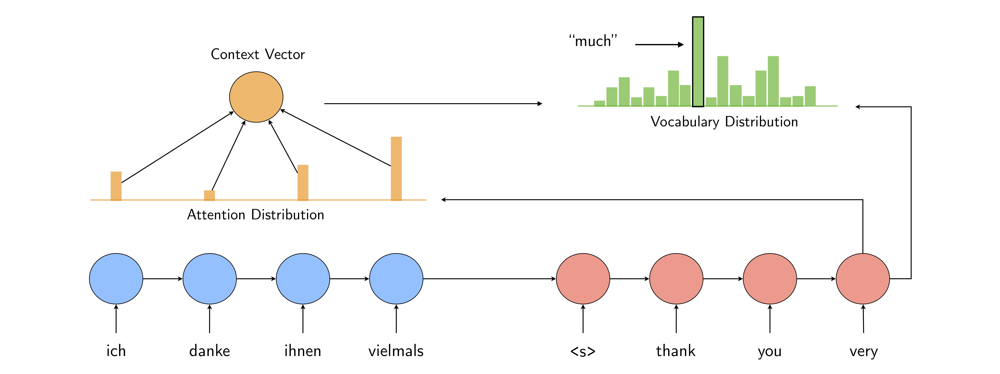

### Overview
This repository contains PyTorch implementations of sequence to sequence models for machine translation. The code is based on [fairseq](https://github.com/pytorch/fairseq) and purportedly made simple for the sake of readability, although main features such as multi-GPU training and beam search remain intact.

Two encoder-decoder models are implemented in this repository: a classic model based on LSTM networks with attention mechanism [(Bahdanau et al.)](https://arxiv.org/abs/1409.0473) and Transformer, a recently favored model built entirely from self-attention [(Vaswani et al.)](https://arxiv.org/abs/1706.03762).



### Installation
The code was written for Python 3.6 or higher, and it has been tested with [PyTorch](http://pytorch.org/) 0.4.1. Training is only available with GPU. To get started, try to clone the repository

```bash
git clone https://github.com/tangbinh/machine-translation
cd machine-translation
```

### Preprocessing
To download the IWSLT'14 DE-EN dataset and perform tokenization, it might be easier to just run:
```bash
bash download.sh
```
Then, the following commands help build dictionaries and map tokens into indices:
```bash
DATA_PATH=data/iwslt14.tokenized.de-en
python preprocess.py --source-lang de --target-lang en --train-prefix $DATA_PATH/train --valid-prefix $DATA_PATH/valid --test-prefix $DATA_PATH/test --dest-dir data-bin/iwslt14.tokenized.de-en
```

### Training
To get started with training a model on SQuAD, you might find the following commands helpful:
```bash
python train.py --data data-bin/iwslt14.tokenized.de-en --source-lang de --target-lang en --lr 0.25 --clip-norm 0.1 --max-tokens 12000 --save-dir checkpoints/transformer
```

### Prediction
When the training is done, you can make predictions and compute BLEU scores:
```bash
python generate.py --data data-bin/iwslt14.tokenized.de-en --checkpoint-path checkpoints/transformer/checkpoint_best.pt > /tmp/lstm.out
grep ^H /tmp/lstm.out | cut -f2- | sed -r 's/'$(echo -e "\033")'\[[0-9]{1,2}(;([0-9]{1,2})?)?[mK]//g' > /tmp/transformer.sys
grep ^T /tmp/lstm.out | cut -f2- | sed -r 's/'$(echo -e "\033")'\[[0-9]{1,2}(;([0-9]{1,2})?)?[mK]//g' > /tmp/transformer.ref
python score.py --reference /tmp/transformer.ref --system /tmp/transformer.sys
```